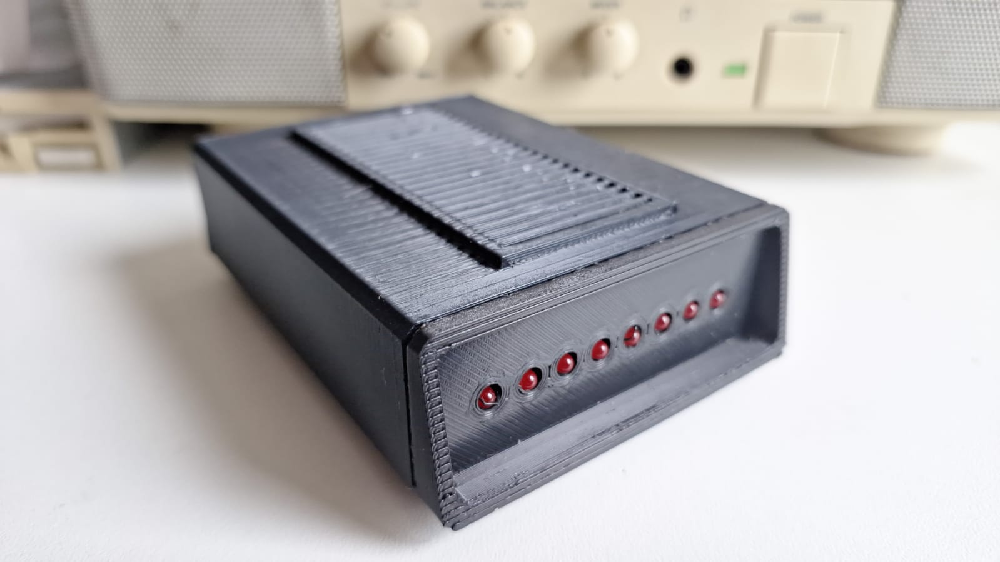

# Retro WiFi modem

## An ESP8266 based RS232 \<-\> WiFi modem with Hayes AT style commands and LED indicators

## Changes Introduced

I will keep entire text from Ben readme below as it is the same.
Few changes were introduced.
1. Added sound back (a merge from original code from mecparts into Ben's code)
2. Changed the original kicad to create a new compact board that can be used with 2 differente cases.
3. A second kicad version to use MAX3232 instead MAX3237

Reason behind those changes are:
1. I was looking for something that had telnet, PPP and sound. Ben made a fork and introduced the PPP before the Sound functionality was implemented in the original project. So I just did a merge to bring it back.
2. Using original project, I changed the pcb to be suitable to custom ideas, adding headers, option for amp, external speaker, pots, different power inputs, power switch, serial header, ...
3. I am a nightmare with smd .. so I tried to do something with dip instead to make it easy for anyone, replacing all smd in the project. This one is a simple project for use in just one case (Mini Courier). It also introduced back the original problem project was facing with garbage while initializing the esp8266 (MAX3237 has enable gate, MAX3232 doesn't)

Cases I made for this project are available at Thingverse.
1. Mini Courier Modem - https://www.thingiverse.com/thing:7182022
2. Retro External Modem - https://www.thingiverse.com/thing:7182050 

Btw .. MAX3232. There is a lot of fakes out there. I tried eBay, AliExpress and some local market. All in the garbage bin.
If you want build your modem. Doesn't matter if MAX3237 or MAX3232 .. buy it from mouser or farnell.

## Original Instructions
   
This project is a small set of tweaks and updates to
[mecparts' RetroWiFiModem](https://github.com/mecparts/RetroWiFiModem) to
add some small features that I find useful and to incorporate fixes from the
firmware that go with the v2 version of the hardware.

For full documentation please see the
[v1 hardware snapshot](https://github.com/mecparts/RetroWiFiModem/releases/tag/v1.0.0)
of the original project as this README only covers the changes I have
made.

## Changes from v1 hardware snapshot

* Certain unsupported Telnet options used by a particular MUD server are
now explicitly blocked ([fixed in v2 firmware](https://github.com/mecparts/RetroWiFiModem/commit/71e6d993fff2592599ee5b3d3447f20c63cd9b56),
brought over to v1).
* Changing hardware flow control with AT&K*n* now takes effect immediately
whereas before you'd need to save your changes then restart the modem.
* AT&CS and AT&RS commands provide read/write and read-only access to the
CTS and RTS lines respectively when hardware flow control is disabled.
* AT$HOST can be used to query or change the hostname. ATI, AT&V and AT?
have also been updated to cover this new command.
* When in Telnet mode `WILL`/`WON'T`/`DO`/`DON'T` `TRANSMIT-BINARY` enable
or disable binary transmission mode for the receiver or transmitter as
appropriate. Binary transmission mode is referred to as "fake" Telnet in
the RetroWiFiModem documentation, with "real" Telnet being NVT ASCII mode.
In NVT ASCII mode `CR` is normally escaped to `CR` `NUL` unless it's a line
break (`CR` `LF`). In binary mode `CR` is left alone.
* PPP connections can be made by dialling the special number `*99#`. This
number can be changed with AT$PPP.

## Command reference

Multiple AT commands can be typed in on a single line. Spaces between
commands are allowed, but not within commands (i.e. AT S0=1 X1 Q0 is
fine; ATS 0=  1 is not). Commands that take a string as an argument
(e.g. AT$SSID=, AT$TTY=) assume that *everything* that follows is a part
of the string, so no commands are allowed after them.

Command | Details
------- | -------
+++     | Online escape code. Once your modem is connected to another device, the only command it recognises is an escape code of a one second pause followed by three typed plus signs and another one second pause, which puts the modem back into local command mode. The character used can be set with `ATS2=n`.
A/      | Repeats the last command entered. Do not type AT or press Enter.
AT      | The attention prefix that precedes all command except A/ and +++.
AT?     | Displays a help cheatsheet.
ATA     | Force the modem to answer an incoming connection when the conditions for auto answer have not been satisfied.
ATC? ATC*n* | Query or change the current WiFi connection status. A result of 0 means that the modem is not connected to WiFi, 1 means the modem is connected. The command ATC0 disconnects the modem from a WiFi connection. ATC1 connects the modem to the WiFi.
ATDS*n* | Calls the host specified in speed dial slot *n* (0-9).
ATDT<i>[+=-]host[:port]</i> | Tries to establish a WiFi TCP connection to the specified host name or IP address. If no port number is given, 23 (Telnet) is assumed. You can also use ATDT to dial one of the speed dial slots in one of two ways:  <ul><li>The alias in each speed dial slot is checked to see if it matches the specified hostname.</li><li>A host specified as 7 identical digits dials the slot indicated by the digit. (i.e. 2222222 would speed dial the host in slot 2).</li></ul>Preceding the host name or IP address with a +, = or - character overrides the ATNET setting for the period of the connection.  <ul><li>**+** forces NET2 (fake Telnet)</li><li>**=** forces NET1 (real Telnet)</li><li>**-** forces NET0 (no Telnet)</li></ul>Once the dial attempt has begun, pressing any key before the connection is established will abort the attempt.
ATE? ATE*n* | Command mode echo. Enables or disables the display of your typed commands.  <ul><li>E0 Command mode echo OFF. Your typing will not appear on the screen.</li><li>E1 Command mode echo ON. Your typing will appear on the screen.</li></ul>
ATGET*http&#58;//host[/page]* | Displays the contents of a website page. **https** connections are not supported. Once the contents have been displayed, the connection will automatically terminate.
ATH | Hangs up (ends) the current connection.
ATI | Displays the current network status, including sketch build date, WiFi and call connection state, SSID name, IP address, and bytes transferred.
ATNET? ATNET*n* | Query or change whether telnet protocol is enabled. A result of 0 means that telnet protocol is disabled; 1 is *Real* telnet protocol and 2 is *Fake* telnet protocol. If you are connecting to a telnet server, it may expect the modem to respond to various telnet commands, such as terminal name (set with `AT$TTY`), terminal window size (set with `AT$TTS`) or terminal speed. Telnet protocol should be enabled for these sites, or you will at best see occasional garbage characters on your screen, or at worst the connection may fail.  The difference between *real* and *fake* telnet protocol is this: with *real* telnet protocol, a carriage return (CR) character being sent from the modem to the telnet server always has a NUL character added after it. The implementation of the telnet protocol used by some BBSes doesn't properly strip out the NUL character. When connecting to such BBSes (Particles! is one), use *fake* telnet.  When using *real* telnet protocol, when the telnet server sends a CR character followed by a NUL character, only the CR character will be sent to the serial port; the NUL character will be silently stripped out. With *fake* telnet protocol, the NUL will be passed through.
ATO | Return online. Use with the escape code (+++) to toggle between command and online modes.
ATQ? ATQ*n* | Enable or disable the display of result codes. The default is Q0.  <ul><li>Q0 Display result codes.</li><li>Q1 Suppress result codes (quiet).</li></ul>
ATRD ATRT | Displays the current UTC date and time from NIST in the format *YY-MM-DD HH:MM:SS*. A WiFi connection is required and you cannot be connected to another site.
ATS0? ATS0=*n* | Display or set the number of "rings" before answering an incoming connection. Setting `S0=0` means "don't answer".
ATS2? ATS2=*n* | Display or set the ASCII code used in the online escape sequence. The default value is 43 (the + plus character). Setting it to any value between 128 and 255 will disable the online escape function.
ATV? ATV*n* | Display result codes in words or numbers. The default is V1.  <ul><li>V0 Display result codes in numeric form.</li><li>V1 Display result codes in text form.</li></ul>
ATX? ATX*n* | Control the amount of information displayed in the result codes. The default is X1 (extended codes).  <ul><li>X0 Display basic codes (CONNECT, NO CARRIER)</li><li>X1 Display extended codes (CONNECT speed, NO CARRIER (connect time))</li></ul>
ATZ | Resets the modem.
AT&F | Reset the NVRAM contents and current settings to the sketch defaults. All settings, including SSID name, password and speed dial slots are affected.
AT&K? AT&K*n* | Data flow control. Prevents the modem's buffers for received and transmitted from overflowing.  <ul><li>&K0 Disable data flow control.</li><li>&K1 Use hardware flow control. Requires that your computer and software support Clear to Send (CTS) and Request to Send (RTS) at the RS-232 interface.</li></ul>
AT&CS? AT&CS*n* | CTS status. When hardware flow control is disabled this lets you query or set the state of the CTS line.  <ul><li>&CS0 de-assert CTS.</li><li>&CS1 assert CTS.</li></ul>
AT&RS? | RTS status. When hardware flow control is disabled this lets you query the state of the RTS line.
AT&R? AT&R=*server pwd* | Query or change the password for incoming connections. If set, the user has 3 chances in 60 seconds to enter the correct password or the modem will end the connection.
AT&V*n* | Display current or stored settings.  <ul><li>&V0 Display current settings.</li><li>&V1 Display stored settings.</li></ul>
AT&W | Save current settings to NVRAM.
AT&Zn? AT&Z*n*=*host[:port],alias* | Store up to 10 numbers in NVRAM, where *n* is the position 0-9 in NVRAM, and *host[:port]* is the host string, and *alias* is the speed dial alias name. The host string may be up to 50 characters long, and the alias string may be up to 16 characters long.  Example: `AT&Z2=particlesbbs.dyndns.org:6400,particles`  This number can then be dialed in any of the following ways:  <ul><li>`ATDS2`</li><li>`ATDTparticles`</li><li>`ATDT2222222`</li></ul>
AT$AE? AT$AE=*startup AT cmd* | Query or change the command line to be executed when the modem starts up.
AT$AYT | Sends a Telnet "Are You There?" command if connected to a Telnet remote.
AT$BM? AT$BM=*server busy msg* | Query or change a message to be returned to an incoming connection if the modem is busy (i.e. already has a connection established).
AT$MDNS? AT$MDNS=*mDNS name* | Query or change the mDNS network name (defaults to "RetroWiFiModem"). When a non zero TCP port is defined, you can telnet to that port with **telnet mdnsname.local port**.
AT$HOST? AT$HOST=*hostname* | Query or change the host name (defaults to ESP-*112233* where *112233* are last three bytes of the device's MAC in hexadecimal).
AT$PASS? AT$PASS=*WiFi pwd* | Query or change the current WiFi password. The password is case sensitive. Clear the password by issuing the set command with no password. The maximum length of the password is 64 characters.
AT$PPP? AT$PPP=*PPP number* | Query or change the number that, when dialled, establishes a PPP connection.
AT$SB? AT$SB=*n* | Query or change the current baud rate. Valid values for "n" are 110, 300, 450, 600, 710, 1200, 2400, 4800, 9600, 19200, 38400, 57600, 76800 and 115200. Any other value will return an ERROR message. The default baud rate is 1200. The Retro WiFi modem does not automatically detect baud rate like a dial-up modem. The baud rate setting must match that of your terminal to operate properly. It will display garbage in your terminal otherwise.
AT$SP? AT$SP=*n* | TCP server port to listen on. A value of 0 means that the TCP server is disabled, and no incoming connections are allowed.
AT$SSID? AT$SSID=*ssid name* | Query or change the current SSID to the specified name. The given SSID name is case sensitive. Clear the SSID by issuing the set command with no SSID. The maximum length of the SSID name is 32 characters.
AT$SU? AT$SU=*dps* | Query or change the current number of data bits ('d'), parity ('p') and stop bits ('s") of the serial UART. Valid values for 'd' are 5, 6, 7 or 8 bits. Valid values for 'p' are (N)one, (O)dd or (E)ven parity. Valid values for 's' are 1 or 2 bits. The default settings are 8N1. The UART setting must match your terminal to work properly.
AT$TTL? AT$TTL=*telnet location* | Query or change the Telnet location value to be returned when the Telnet server issues a SEND-LOCATION request. The default value is "Computer Room".
AT$TTS? AT$TTS=*WxH* | Query or change the window size (columns x rows) to be returned when the Telnet server issues a NAWS (Negotiate About Window Size) request. The default value is 80x24. For terminals that are smaller than 80x24, setting these values appropriately will enable paging on the help (AT?) and network status (ATI) commands.
AT$TTY? AT$TTY=*terminal type* | Query or change the terminal type to be returned when the Telnet server issues a TERMINAL-TYPE request. The default value is "ansi".
AT$W? AT$W=*n* | Startup wait.  <ul><li>$W=0 Startup with no wait.</li><li>$W=1 Wait for the return key to be pressed at startup.</li></ul>

## References

* [mecparts' RetroWiFiModem](https://github.com/mecparts/RetroWiFiModem)
* [ssshake's vintage-computer-wifi-modem](https://github.com/ssshake/vintage-computer-wifi-modem/)

## Acknowledgements

* Thank you to mecparts for sharing their excellent work!
* The PPP implementation was heavily cribbed from ssshake's vintage-computer-wifi-modem.
